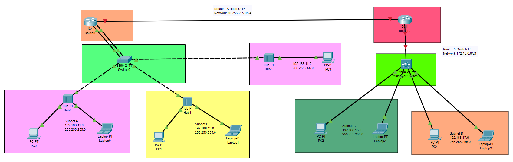

Udemy Course >> Cisco Packet Tracer Network Administration CCT/CCNA LAB Part 3 (CCNA 200-301)


**********

Complete CCT CCNA Lab Cisco Packet Tracer Network Administration CCNA 200-301 Routing Switching Configuration Troubleshooting P3


**********

Tips/Tricks/Notes/Commands URL Link:

https://github.com/nimaxnimax/Udemy_Cisco_Packet_Tracer_Net_Admin_CCNA_LAB


Instructor & Courses >> 

https://www.udemy.com/user/adrian-fischer-infotech/


**********

Packet Tracer Lab File >> Template >> Lab_Template.pkt

Packet Tracer Lab File >> Completed >> Lab_Completed.pkt


**********

Lab Info >> Packet Tracer Default Username and Password >> cisco/cisco


**********

DHCP Configuration >> Router1

```bash
!
ip dhcp excluded-address 192.168.11.200 192.168.11.254
ip dhcp excluded-address 192.168.13.200 192.168.13.254
!
ip dhcp pool SUBNET-A
 network 192.168.11.0 255.255.255.0
 default-router 192.168.11.254
 dns-server 8.8.8.8
ip dhcp pool SUBNET-B
 network 192.168.13.0 255.255.255.0
 default-router 192.168.13.254
 dns-server 1.1.1.1
!
!
```

```bash
show run | section dhcp
clear ip dhcp conflict *
show ip dhcp binding
```

MLS 3560 Switch Configuration >>

```bash
!
ip dhcp excluded-address 192.168.15.200 192.168.15.254
ip dhcp excluded-address 192.168.17.200 192.168.17.254
!
ip dhcp pool SUBNET-C
 network 192.168.15.0 255.255.255.0
 default-router 192.168.15.254
 dns-server 1.1.1.1
ip dhcp pool SUBNET-D
 network 192.168.17.0 255.255.255.0
 default-router 192.168.17.254
 dns-server 1.1.1.1
!
!
ip routing

!
interface FastEthernet0/1
 no switchport
 ip address 172.16.0.1 255.255.255.0
 duplex auto
 speed auto
!
interface FastEthernet0/2
 switchport access vlan 15
 switchport mode access
!
interface FastEthernet0/3
 switchport access vlan 15
 switchport mode access
!
interface FastEthernet0/4
 switchport access vlan 17
 switchport mode access
!
interface FastEthernet0/5
 switchport access vlan 17
 switchport mode access
!

!
interface Vlan1
 no ip address
 shutdown
!
interface Vlan15
 ip address 192.168.15.254 255.255.255.0
!
interface Vlan17
 ip address 192.168.17.254 255.255.255.0
!
```

R1 Config >>

```bash
!
interface FastEthernet0/0/0
 switchport mode access
 switchport access vlan 1
 no shutdown
!
interface Vlan1
 ip address 10.255.255.1 255.255.255.0
!
ip route 192.168.15.0 255.255.255.0 10.255.255.2 
ip route 192.168.17.0 255.255.255.0 10.255.255.2 
!
!
```

R2 Config >>

```bash
!
interface GigabitEthernet0/0
 ip address 10.255.255.2 255.255.255.0
 duplex auto
 speed auto
!
interface GigabitEthernet0/1
 ip address 172.16.0.2 255.255.255.0
 duplex auto
 speed auto
!
ip route 192.168.11.0 255.255.255.0 10.255.255.1 
ip route 192.168.13.0 255.255.255.0 10.255.255.1 
ip route 192.168.15.0 255.255.255.0 172.16.0.1 
ip route 192.168.17.0 255.255.255.0 172.16.0.1 
!

```

MLS Config >>

```bash
hostname MLS
!
!
!
ip dhcp excluded-address 192.168.15.200 192.168.15.254
ip dhcp excluded-address 192.168.17.200 192.168.17.254
!
ip dhcp pool SUBNET-C
 network 192.168.15.0 255.255.255.0
 default-router 192.168.15.254
 dns-server 1.1.1.1
ip dhcp pool SUBNET-D
 network 192.168.17.0 255.255.255.0
 default-router 192.168.17.254
 dns-server 1.1.1.1
!
!
ip routing
!
!
!
interface FastEthernet0/1
 no switchport
 ip address 172.16.0.1 255.255.255.0
 duplex auto
 speed auto
!
interface FastEthernet0/2
 switchport access vlan 15
 switchport mode access
!
interface FastEthernet0/3
 switchport access vlan 15
 switchport mode access
!
interface FastEthernet0/4
 switchport access vlan 17
 switchport mode access
!
!
interface Vlan1
 no ip address
 shutdown
!
interface Vlan15
 ip address 192.168.15.254 255.255.255.0
!
interface Vlan17
 ip address 192.168.17.254 255.255.255.0
!
ip route 192.168.11.0 255.255.255.0 172.16.0.2 
ip route 192.168.13.0 255.255.255.0 172.16.0.2 
!

```


**********

If you have problem with some configurations and services on cisco routers and switches check the commands below...

Command >>
```bash
enable
```


Command >>
```bash
reload
```


Command >>
```bash
line console 0
login
password cisco
do write
```


Command >>
```bash
show mac address-table dynamic
```


Command >>
```bash
conf t
hostname switch
hostname router
do write
```


Command >>
```bash
conf t
interface fa0/0
speed 10
speed 100
speed 1000
speed auto
exit
```


Command >>
```bash
show running-config
show startup-config
```


Command >>
```bash
write erase
```


Command >>
```bash
erase startup-config
```


Command >>
```bash
erase nvram:
```


Command >>
```bash
undebug all
```


Command >>
```bash
copy running-config startup-config
write
```


Command >>
```bash
show interfaces
```


Command >>
```bash
show interfaces fa0/1 counters
```


Command >>
```bash
show mac address-table dynamic interface fa0/1
```


Command >>
```bash
show mac address-table dynamic vlan 1
```


Command >>
```bash
show mac address-table aging-time
```


Command >>
```bash
show mac address-table count
```


Command >>
```bash
enable secret cisco
```


Command >>
```bash
line vty 0 15
password cisco
login
end
```


Command >>
```bash
ip domain-name example.local
crypto key generate rsa
username cisco secret cisco
username admin secret admin
line vty 0 15
login local
exit
ip ssh version 2
exit
```


Command >>
```bash
line vty 0 15
transport input all
```


Command >>
```bash
line vty 0 15
transport input telnet ssh
```


Command >>
```bash
line vty 0 15
transport input ssh
```


Command >>
```bash
show ip ssh
show ssh
```


Command >>
```bash
interface vlan 1
no ip address
shutdown
exit
```


Command >>
```bash
interface vlan 11
ip address 192.168.11.251 255.255.255.0
no shutdown
exit
vlan 11
name Sales
exit
```


Command >>
```bash
interface vlan 13
ip address 192.168.13.251 255.255.255.0
no shutdown
exit
vlan 13
name Marketing
exit
```


Command >>
```bash
show ip int bri
```


Command >>
```bash
show vlan
```


Command >>
```bash
show int vlan 11
show int vlan 13
```


Command >>
```bash
show arp
```


Command >>
```bash
show cdp nei
```


Command >>
```bash
show int status
```


Command >>
```bash
int fa0/4
switchport
sw access vlan 11
sw mode access
```


Command >>
```bash
int fa0/5
switchport
sw access vlan 13
sw mode access
```


Command >>
```bash
show cdp neighbors detail
```


Command >>
```bash
int fa0/1
switchport
sw access vlan 11
sw mode access
```


Command >>
```bash
int fa0/2
switchport
sw access vlan 13
sw mode access
```


Command >>
```bash
int fa0/3
switchport
sw access vlan 13
sw mode access
```


Command >>
```bash
ip default-gateway 192.168.11.254
```


Command >>
```bash
show run
write
show startup
```


Command >>
```bash
show ip route
```


Command >>
```bash
show history
```


Command >>
```bash
interface fa0/0
speed auto
dupelx half
duplex full
duplex auto
exit
```


Command >>
```bash
interface fa0/0 - 1
no shut
```


Command >>
```bash
show int fa0/0
```


Command >>
```bash
int fa0/0
no speed
no duplex
description UPLINK/ACCESS
no description
```


Command >>
```bash
show int status
show int fa0/1 status
```


Command >>
```bash
ping 192.168.11.254
ping 192.168.11.251
ping 192.168.13.254
```


Command >>
```bash
show arp
```


Command >>
```bash
conf t
cdp run
int fa0/0
cdp enable
```


Command >>
```bash
conf t
no cdp run
int fa0/0
no cdp enable
```


Command >>
```bash
traceroute 192.168.11.1
traceroute 192.168.11.254
traceroute 192.168.13.1
traceroute 192.168.13.254
```


PC Command >>
```bash
arp -a
ipconfig
ipconfig /all
ping 192.168.11.254
ping 192.168.13.254
tracert 192.168.11.1
tracert 192.168.13.1
```

