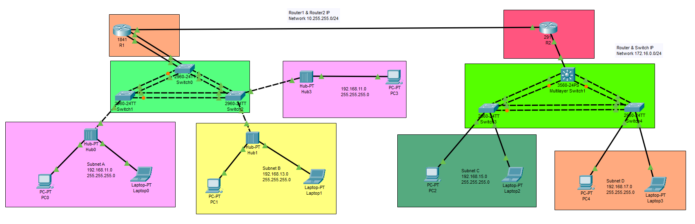
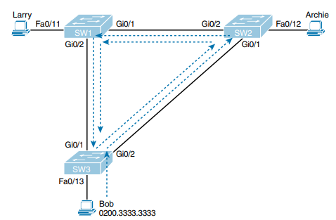
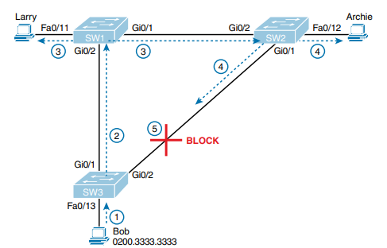

Udemy Course >> Cisco Packet Tracer Network Administration CCT/CCNA LAB Part 4 (CCNA 200-301)

**********

Complete CCT CCNA Lab Cisco Packet Tracer Network Administration CCNA 200-301 Routing Switching Configuration Troubleshooting P4

**********

Tips/Tricks/Notes/Commands URL Link:

https://github.com/nimaxnimax/Udemy_Cisco_Packet_Tracer_Net_Admin_CCNA_LAB

Instructor & Courses >> 

https://www.udemy.com/user/adrian-fischer-infotech/

**********

Packet Tracer Lab File >> Template >> Lab_Template.pkt

Packet Tracer Lab File >> Completed >> Lab_Completed.pkt

**********

Lab Info >> Packet Tracer Default Username and Password >> cisco/cisco

**********

Spanning Tree Protocol (STP) is a network protocol used to prevent loops in bridged or switched networks. Loops can occur when there are redundant paths between network devices, and if not properly managed, they can cause network congestion and even network outages.

STP works by allowing network switches to exchange information about their connections and then collectively decide which paths should be active and which should be blocked to ensure there is only one active path between any two network devices. This active path forms a loop-free topology.

Here are some key points about STP and its importance:

1. **Loop Prevention**: The primary function of STP is to prevent loops in the network. Loops occur when there are multiple paths between switches, and packets end up being forwarded endlessly between them. STP ensures that only one active path exists between any two network devices, effectively eliminating loops.

2. **Redundancy**: While loops are undesirable, having redundant links in a network can be beneficial for fault tolerance and load balancing. STP allows for the creation of a loop-free topology while still utilizing redundant links. If the active path fails, STP reconverges to use an alternate path, ensuring network reliability.

3. **Automatic Configuration**: STP operates autonomously once configured. It dynamically determines the best paths and adjusts the network topology in response to changes such as link failures or additions, without requiring manual intervention.

4. **Compatibility**: STP is a widely adopted standard and is supported by most network switches and routers. This makes it a versatile solution for ensuring loop-free operation in Ethernet networks.

5. **Variants and Enhancements**: Over time, various enhancements and extensions to STP have been developed to improve its efficiency and convergence time. These include Rapid Spanning Tree Protocol (RSTP) and Multiple Spanning Tree Protocol (MSTP), which offer faster convergence and better support for VLANs, respectively.

STP is crucial for maintaining a stable and efficient network infrastructure by preventing loops and ensuring reliable communication between network devices. Its automatic operation and widespread support make it an essential protocol in modern Ethernet networks.

**********

Spanning Tree Protocol (STP) and Rapid Spanning Tree Protocol (RSTP) are both network protocols designed to prevent loops in bridged or switched networks, but they differ in their operation and features. Here's a comparison between the two:

1. **Convergence Time**:
   - STP: Traditional STP typically has a convergence time of around 30 to 50 seconds. This is because it goes through multiple stages (blocking, listening, learning, and forwarding) before determining the optimal topology.
   - RSTP: RSTP significantly improves convergence time compared to STP. It typically converges in just a few seconds (usually less than 5 seconds) by using techniques like port roles (e.g., discarding, learning, forwarding) and link types (e.g., point-to-point, edge).

2. **Topology Changes**:
   - STP: In STP, topology changes are detected by exchanging Bridge Protocol Data Units (BPDUs) between switches. Upon detecting a change, STP goes through the entire convergence process, leading to longer reconvergence times.
   - RSTP: RSTP reduces the impact of topology changes by immediately transitioning ports to the forwarding state when a topology change occurs. This rapid transition helps to minimize the disruption caused by network changes.

3. **Port States**:
   - STP: STP has five port states: blocking, listening, learning, forwarding, and disabled. Ports go through these states sequentially during the convergence process.
   - RSTP: RSTP simplifies the port states to three: discarding (similar to blocking in STP), learning, and forwarding. This simplification helps in faster convergence by reducing the number of states a port goes through.

4. **Backward Compatibility**:
   - STP: Traditional STP is backward compatible with older switches that only support STP. However, it does not take advantage of the rapid convergence features of RSTP.
   - RSTP: RSTP is backward compatible with STP, allowing RSTP-enabled switches to interoperate with legacy STP switches. RSTP switches can also operate in a compatibility mode where they function as STP switches when communicating with legacy devices.

5. **Protocol Overhead**:
   - STP: Traditional STP has relatively high protocol overhead due to the periodic exchange of BPDUs and the longer convergence time.
   - RSTP: RSTP reduces protocol overhead by minimizing the frequency of BPDU exchanges and by quickly converging to the optimal topology.

RSTP offers significant improvements over traditional STP in terms of convergence time, handling topology changes, and reducing protocol overhead. Its rapid convergence makes it more suitable for modern networks where fast reconvergence is essential for maintaining network stability and minimizing downtime.

**********



A broadcast storm is a phenomenon that occurs in a computer network when a large volume of broadcast or multicast messages is generated by one or more network devices, leading to a significant increase in network traffic and potentially causing network congestion or even network failure. Here are some advantages, disadvantages, and the relationship between broadcast storms and STP:

Advantages:

1. **Redundancy Testing**: Broadcast storms can inadvertently reveal weaknesses or inefficiencies in network redundancy configurations. By flooding the network with broadcasts, potential issues with redundant paths and loops can be uncovered, allowing network administrators to address them proactively.

2. **Network Troubleshooting**: In some cases, broadcast storms can help pinpoint faulty network equipment or misconfigurations. When a broadcast storm occurs, it can quickly draw attention to the affected network segment, aiding in the troubleshooting process.

Disadvantages:

1. **Network Congestion**: One of the most significant drawbacks of broadcast storms is the resulting network congestion. The excessive volume of broadcast traffic can saturate network links and overwhelm network devices, leading to degraded performance or complete network outage.

2. **Packet Loss and Latency**: As network devices become inundated with broadcast traffic, they may struggle to process legitimate data packets, resulting in increased packet loss and latency for normal network traffic.

3. **Service Disruption**: In extreme cases, a severe broadcast storm can bring down an entire network, causing widespread service disruption and downtime for users and applications.

Relation to STP:

Spanning Tree Protocol (STP) plays a crucial role in mitigating the risks associated with broadcast storms. By actively monitoring the network topology and selectively blocking redundant paths, STP helps prevent the formation of network loops, which are often a precursor to broadcast storms.

Here's how STP helps address broadcast storms:

1. **Loop Prevention**: STP ensures that redundant paths in the network are identified and blocked to prevent the formation of loops. By maintaining a loop-free topology, STP reduces the likelihood of broadcast storms occurring due to looping broadcast traffic.

2. **Topology Changes**: In the event of a network topology change, such as a link failure or addition, STP rapidly reconverges to adapt to the new topology and prevent the propagation of broadcast storms. This rapid reconvergence helps minimize the duration and impact of potential broadcast storms on the network.

While broadcast storms can pose significant challenges to network stability and performance, STP serves as a critical mechanism for mitigating the risks associated with these disruptive events and maintaining a resilient and efficient network infrastructure.

**********

When redundant LANs (Local Area Networks) are deployed without using Spanning Tree Protocol (STP) or a similar loop prevention mechanism, several classes of problems can arise, which can severely impact network performance, stability, and reliability. Here are three main classes of problems caused by not using STP in redundant LANs:

1. **Broadcast Storms**:
   - **Description**: A broadcast storm occurs when broadcast or multicast packets flood the network, often due to network loops. Without STP to prevent loops, broadcast packets can endlessly circulate between network devices, exponentially increasing traffic volume and consuming network resources.
   - **Impact**: Broadcast storms lead to network congestion, packet collisions, increased latency, and degraded performance for all network traffic. They can ultimately result in network downtime or severe service disruptions.
   - **Example**: In a redundant LAN configuration without STP, if a broadcast packet is sent out from a device and encounters multiple redundant paths, it can loop back to the originating device, initiating a broadcast storm.

2. **MAC Address Table Instability**:
   - **Description**: In a redundant LAN environment without STP, network switches may encounter inconsistent or conflicting MAC address tables due to the presence of network loops. Switches learn MAC addresses associated with specific ports, but in the presence of loops, they may receive MAC addresses from multiple ports simultaneously, leading to ambiguity and instability.
   - **Impact**: MAC address table instability can cause packet forwarding errors, resulting in misdirected traffic, packet drops, or even network loops. This instability can disrupt normal network operations and compromise network performance.
   - **Example**: Without STP, if a switch receives frames with the same source MAC address from multiple ports simultaneously due to a loop, it may have difficulty determining the correct egress port for forwarding subsequent frames to that MAC address.

3. **Switching Loops and Packet Duplication**:
   - **Description**: In the absence of STP, redundant LAN configurations can create switching loops where packets circulate endlessly between switches. These loops cause packets to be duplicated and forwarded repeatedly, leading to inefficient use of network bandwidth and resources.
   - **Impact**: Switching loops result in increased network traffic, congestion, and degradation of network performance. Duplicate packets consume network bandwidth and can overwhelm network devices, potentially causing network instability or failure.
   - **Example**: If two switches are interconnected via multiple redundant links without STP, a packet sent from one switch may traverse both links repeatedly, resulting in packet duplication and wasting network resources.

Not using STP in redundant LANs can lead to various problems such as broadcast storms, MAC address table instability, and switching loops, all of which can degrade network performance, stability, and reliability. Implementing STP or a similar loop prevention mechanism is essential for maintaining a robust and efficient network infrastructure.

**********



Spanning Tree Protocol (STP) and Rapid Spanning Tree Protocol (RSTP) are network protocols designed to prevent loops in bridged or switched networks. One of the fundamental actions performed by STP/RSTP to prevent loops is to block specific ports in the network topology. This action helps break potential loops and ensures the creation of a loop-free network topology. Here's how STP/RSTP accomplishes this:

1. **Loop Detection and Prevention**:
   - When switches are interconnected to form a network, there is a possibility of creating loops, especially in redundant network designs where multiple paths exist between switches.
   - STP/RSTP algorithms run on the switches to detect and mitigate these loops. They achieve this by collectively electing a root bridge (the switch serving as the root of the spanning tree) and selectively blocking ports to prevent loops.

2. **Root Bridge Election**:
   - The first step in loop prevention is to elect a root bridge. Each switch in the network compares the Bridge ID (BID), which consists of a priority value and a MAC address, of all the switches it knows about. The switch with the lowest BID becomes the root bridge.
   - All ports on the root bridge remain in the forwarding state because it serves as the reference point for the spanning tree topology.

3. **Designated and Non-Designated Ports**:
   - After electing the root bridge, each non-root switch selects one of its ports as the root port (the port through which it has the shortest path to the root bridge).
   - The remaining ports on each switch are designated ports, which are responsible for forwarding traffic toward the root bridge.
   - Any ports that are not root ports or designated ports are considered non-designated ports.

4. **Blocking Ports**:
   - STP/RSTP determines additional ports that need to be blocked to eliminate loops in the network topology. These ports are typically those that would create a loop if left in the forwarding state.
   - Blocking a port effectively disables it from forwarding traffic, ensuring that loops cannot form.
   - The blocked ports remain in a state known as the "blocking" or "discarding" state. While in this state, they still listen to BPDUs (Bridge Protocol Data Units) to monitor the network topology and quickly transition to forwarding if necessary due to a topology change.

5. **Adapting to Topology Changes**:
   - STP/RSTP continuously monitors the network topology for changes, such as link failures or additions. When a change occurs, the protocol quickly recalculates the spanning tree and adjusts port states accordingly to maintain a loop-free topology.

STP/RSTP blocks specific ports in the network to break potential loops and ensure the creation of a loop-free spanning tree topology. By selectively blocking ports and continuously adapting to changes in the network, STP/RSTP helps maintain network stability and prevent the adverse effects of loops, such as broadcast storms and network congestion.

**********

Spanning Tree Protocol (STP) is a network protocol used to prevent loops in bridged or switched Ethernet networks. Here's how STP works and the port states associated with it:

1. **Root Bridge Election**:
   - Every switch participating in STP elections initially thinks itself as the root bridge. The process of root bridge election involves comparing Bridge IDs (BIDs), which consist of a priority value and a MAC address. The switch with the lowest BID becomes the root bridge.
   - All other switches in the network then determine their shortest path to the root bridge.

2. **Port States**:
   - **Root Bridge Ports**:
     - Root ports are the ports on non-root bridges that have the shortest path to the root bridge. These ports are in the forwarding state, allowing traffic to flow towards the root bridge.
     - The root bridge itself has all of its ports in the forwarding state because it serves as the reference point for the spanning tree topology.

   - **Non-Root Bridge Ports**:
     - Non-root bridges have ports that are either designated ports or blocked ports.
     - Designated ports are ports on non-root bridges that have the lowest path cost to the root bridge for a particular segment. They are in the forwarding state, forwarding traffic towards the root bridge.
     - Blocked ports are ports that are not designated ports or root ports. These ports are put into a blocking state, effectively blocking any traffic from being forwarded through them. This prevents loops in the network topology.

   - **Ports Connected to End Devices**:
     - Ports connected to end devices (e.g., computers, servers) are typically designated ports because they provide the shortest path to the root bridge for those devices. These ports are in the forwarding state, allowing end device traffic to reach the rest of the network.

3. **Transitioning Between Port States**:
   - Port states transition based on the receipt of Bridge Protocol Data Units (BPDUs) and changes in the network topology.
   - Initially, ports go through the blocking state, then move to the listening state, followed by the learning state, and finally reach the forwarding state.
   - When topology changes occur (e.g., link failure, link recovery), STP reconverges, recalculates the spanning tree, and adjusts port states accordingly to maintain a loop-free topology.

STP works by electing a root bridge and selecting ports on switches to be in forwarding or blocking states based on their role in the spanning tree topology. This process ensures that a loop-free topology is maintained, preventing broadcast storms and other adverse effects of network loops.

**********
**********
**********

Commands

```bash

```

